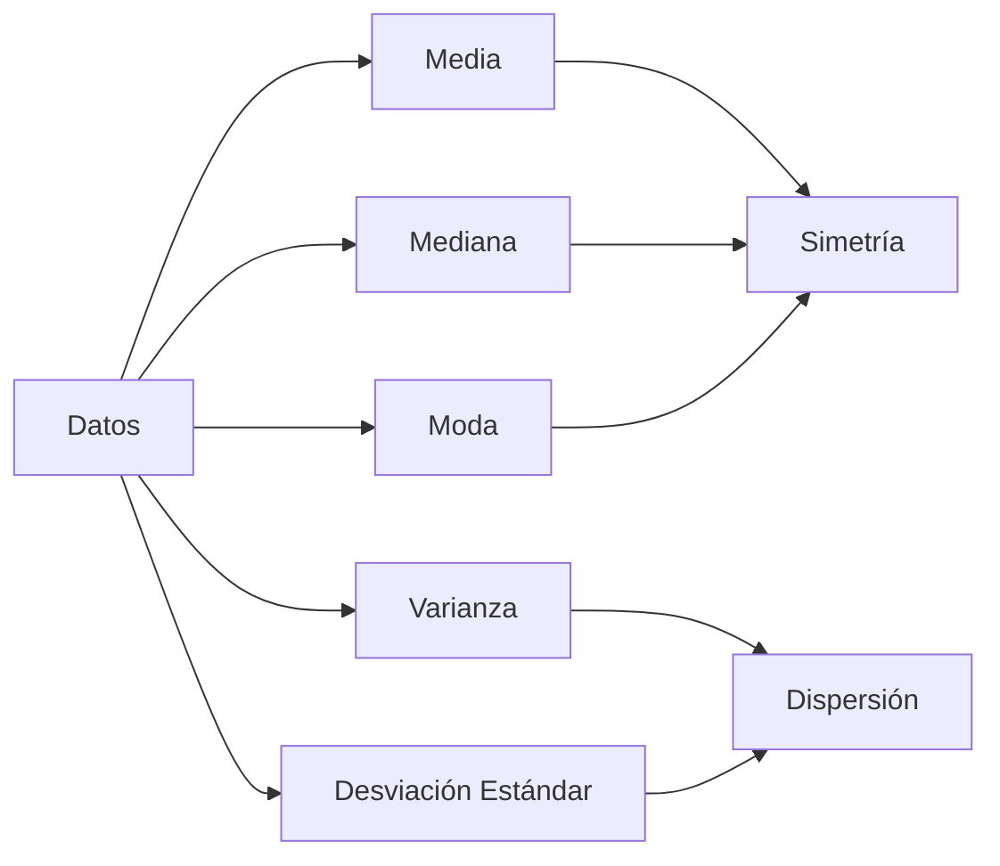

<div align="center">


# 📊 Probabilidad y Estadística Aplicadas al Machine Learning
### Fundamentos estadísticos para el análisis de datos y ML


<p align="center">
  
  
  
</p>


</div>

## 📑 Tabla de Contenidos

<details open>
<summary>Explora los conceptos 📈</summary>

1. [🎲 Distribuciones Numéricas](#-distribuciones-numéricas)
2. [📏 Medidas de Tendencia Central](#-medidas-de-tendencia-central)
3. [📊 Tipos de Variables](#-tipos-de-variables)
4. [📈 Varianza y Desviación](#-varianza-y-desviación)
5. [🎯 Métricas de Evaluación](#-métricas-de-evaluación)
6. [🤖 Modelos y Técnicas](#-modelos-y-técnicas)

</details>


## 🎲 Distribuciones Numéricas

### 📊 Distribución Normal (Gaussiana)

> 💡 **La distribución más importante en estadística**

| Propiedad | Descripción |
|:---------:|:------------|
| 🔄 Simetría | Simétrica alrededor de la media |
| 🔔 Forma | Característica forma de campana |
| 📐 Parámetros | μ (media) y σ (desviación estándar) |

```python
# Visualización en Python
import numpy as np
import matplotlib.pyplot as plt

x = np.random.normal(loc=0, scale=1, size=1000)
plt.hist(x, bins=30, density=True)
```
### 📊 Distribución Binomial

> 💡 **Uso en clasificación y teorema de Bayes**

| Propiedad | Descripción |
|:---------:|:------------|
| 🔄 Experimentos | Número fijo de ensayos |
| 🔔 Éxitos | Probabilidad de éxito en cada ensayo |

```python
# Visualización de la distribución binomial
from scipy.stats import binom
import matplotlib.pyplot as plt

n = 10  # número de ensayos
p = 0.5  # probabilidad de éxito
x = range(n + 1)
pmf = binom.pmf(x, n, p)

plt.bar(x, pmf)
plt.title('Distribución Binomial')
plt.xlabel('Número de Éxitos')
plt.ylabel('Probabilidad')
plt.show()
```

### 📊 Distribución Poisson

> 💡 **Modelado de conteos de eventos**

| Propiedad | Descripción |
|:---------:|:------------|
| 🔄 Eventos | Número de eventos en un intervalo fijo |
| 🔔 Parámetro | λ (tasa de eventos) |

```python
# Visualización de la distribución de Poisson
from scipy.stats import poisson

lambda_ = 3  # tasa de eventos
x = range(0, 10)
pmf = poisson.pmf(x, lambda_)

plt.bar(x, pmf)
plt.title('Distribución de Poisson')
plt.xlabel('Número de Eventos')
plt.ylabel('Probabilidad')
plt.show()
```


#  Análisis

El análisis de datos implica la interpretación de las distribuciones y medidas estadísticas para extraer conclusiones significativas. Se pueden utilizar técnicas como la visualización de datos y el análisis descriptivo.

## 📏 Medidas de Tendencia Central

### 📊 Conceptos Fundamentales

<details open>
<summary><b>📈 Medidas Principales</b></summary>

| Medida | Descripción | Fórmula |
|:------:|:------------|:--------:|
| 📊 Media | Promedio aritmético | $x̄ = \frac{Σx}{n}$ |
| 📏 Mediana | Valor central | - |
| 📈 Moda | Valor más frecuente | - |
| 📉 Rango | Diferencia max-min | $max(x) - min(x)$ |
| 📊 Varianza | Medida de dispersión | $σ^2 = \frac{Σ(x - x̄)^2}{n}$ |
| 📏 Desviación Estándar | Raíz cuadrada de la varianza | $σ = \sqrt{σ^2}$ |
| 📈 Cuartiles | Dividen los datos en cuatro partes | - |
| 📉 Percentiles | Dividen los datos en cien partes | - |

</details>

### 🔄 Visualización de Medidas



### 📊 Ejemplo Práctico

```python
import pandas as pd

# Cargar datos
data = pd.DataFrame({'valores': [1, 2, 2, 3, 4, 5, 5, 5, 6, 7]})

# Calcular medidas
media = data['valores'].mean()
mediana = data['valores'].median()
moda = data['valores'].mode()[0]
varianza = data['valores'].var()
desviacion_estandar = data['valores'].std()

print(f'Media: {media}, Mediana: {mediana}, Moda: {moda}, Varianza: {varianza}, Desviación Estándar: {desviacion_estandar}')
```


### 📉 Sesgo

El sesgo mide la asimetría de la distribución de los datos. Puede ser positivo, negativo o nulo.

- **Sesgo Positivo**: La cola de la distribución se extiende más hacia la derecha.
- **Sesgo Negativo**: La cola de la distribución se extiende más hacia la izquierda.
- **Sesgo Nulo**: La distribución es simétrica.

```python
from scipy.stats import skew

#Calcular el sesgo
sesgo = skew(data['valores'])
print(f'Sesgo: {sesgo}')
```

## 📊 Tipos de Variables

### 🎯 Clasificación Principal

| Tipo | Descripción | Ejemplo | Visualización |
|:----:|:------------|:--------|:-------------:|
| 📋 Nominal | Categorías sin orden | Colores | Gráfico de Barras |
| 📊 Ordinal | Categorías ordenadas | Calificaciones | Gráfico de Barras Ordenado |
| 🔢 Discreta | Valores contables | Número de hijos | Histograma |
| 📈 Continua | Valores en continuo | Altura | Densidad |
| 📏 Uniforme | Todos los resultados tienen la misma probabilidad | Números aleatorios | Gráfico de Barras |
| 📉 Exponencial | Modela el tiempo entre eventos | Tiempo entre llegadas | Gráfico de Densidad |
| 📊 Log-Normal | Variables que crecen exponencialmente | Ingresos | Histograma |
| 📈 Gamma | Modela el tiempo hasta un evento | Tiempo de espera | Gráfico de Densidad |
| 📊 Beta | Variables acotadas en [0, 1] | Probabilidades | Gráfico de Densidad |

<div align="center">


## 📊 Análisis Estadístico y Sesgo

## 📊 Análisis de Datos

El análisis de datos es un proceso fundamental en la estadística y el machine learning que implica la inspección, limpieza y modelado de datos con el objetivo de descubrir información útil, llegar a conclusiones y apoyar la toma de decisiones.

### 📈 Técnicas de Visualización

Las técnicas de visualización son herramientas esenciales para representar datos de manera gráfica, facilitando la comprensión de patrones, tendencias y anomalías. Algunas de las técnicas más comunes incluyen:

- **📊 Gráficos de Barras**: Útiles para comparar cantidades entre diferentes categorías.
- **📈 Histogramas**: Muestran la distribución de un conjunto de datos dividiéndolos en intervalos.
- **🔍 Diagramas de Dispersión**: Ayudan a visualizar la relación entre dos variables.
- **📉 Gráficos de Líneas**: Ideales para mostrar tendencias a lo largo del tiempo.

### 📉 Interpretación de Resultados

La interpretación de los resultados es crucial para extraer conclusiones significativas. Al analizar gráficos y estadísticas, es importante considerar:

- **🔼 Tendencias**: ¿Los datos muestran un aumento o disminución a lo largo del tiempo?
- **🔗 Correlaciones**: ¿Existen relaciones entre diferentes variables?
- **⚠️ Anomalías**: ¿Hay datos que se desvían significativamente de la norma?

Un análisis cuidadoso y una visualización efectiva pueden proporcionar información valiosa que guíe decisiones informadas en proyectos de machine learning y análisis de datos.


## 📊 Técnicas de Clustering

El clustering es una técnica de análisis de datos que agrupa un conjunto de objetos de tal manera que los objetos en el mismo grupo (o clúster) son más similares entre sí que a los de otros grupos. Es ampliamente utilizado en diversas aplicaciones, como segmentación de mercado, análisis de imágenes y compresión de datos.

# 📊 Tipos Comunes de Algoritmos de Clustering

1. **K-Means**: Un algoritmo que divide los datos en K clústeres, donde cada clúster se representa por la media de sus puntos.
2. **Hierarchical Clustering**: Crea un árbol de clústeres que muestra la relación entre los diferentes grupos.
3. **DBSCAN**: Un algoritmo basado en densidad que agrupa puntos cercanos y marca los puntos aislados como ruido.
4. **Mean Shift**: Un algoritmo que busca los puntos de mayor densidad en el espacio de características y agrupa los puntos alrededor de estos.

### 📈 Ejemplo de K-Means en Python


### 📉 Sesgo
El sesgo en estadística se refiere a la tendencia sistemática de un estimador a diferir del valor real del parámetro que se está estimando. En otras palabras, es la diferencia entre el valor esperado de un estimador y el valor verdadero del parámetro. Un sesgo puede ser positivo, negativo o nulo.

### 📉 Impacto en Modelos de Machine Learning

| Tipo de Sesgo | Descripción | Efecto en el Modelo |
|:-------------:|:------------|:--------------------|
| ➡️ Positivo   | El modelo tiende a sobrestimar los resultados. | Predicciones consistentemente más altas. |
| ⬅️ Negativo   | El modelo tiende a subestimar los resultados. | Predicciones consistentemente más bajas. |
| ⚖️ Nulo       | El modelo no tiene una tendencia sistemática. | Predicciones, en promedio, correctas. |

Es crucial identificar y corregir el sesgo en los modelos de machine learning, ya que un sesgo no controlado puede llevar a decisiones erróneas basadas en predicciones inexactas.

### 📈 Conceptos de Sesgo

| Tipo de Sesgo | Descripción | Impacto en ML |
|:-------------:|:------------|:--------------|
| ➡️ Positivo | Cola hacia la derecha | Puede afectar predicciones |
| ⬅️ Negativo | Cola hacia la izquierda | Requiere transformación |
| ⚖️ Nulo | Distribución simétrica | Ideal para muchos modelos |

```python
from scipy.stats import skew
import numpy as np

# Calcular sesgo
datos = np.random.normal(0, 1, 1000)
sesgo = skew(datos)
print(f'Sesgo: {sesgo}')
```

## 🎯 Métricas de Evaluación

### 📊 Métricas de Evaluación

Las métricas de evaluación son fundamentales para medir el rendimiento de los modelos de machine learning. A continuación, se describen algunas de las métricas más comunes:

| Métrica | Descripción |
|:-------:|:------------|
| ✅ **Precisión (Accuracy)** | Proporción de predicciones correctas sobre el total de predicciones. Se utiliza para evaluar modelos de clasificación. |
| 📊 **Precisión (Precision)** | Proporción de verdaderos positivos sobre el total de positivos predichos. Indica cuántas de las predicciones positivas son realmente correctas. |
| 📈 **Recall (Sensibilidad)** | Proporción de verdaderos positivos sobre el total de positivos reales. Mide la capacidad del modelo para identificar correctamente las instancias positivas. |
| 📉 **F1-Score** | La media armónica entre precisión y recall. Es útil cuando se busca un balance entre ambas métricas, especialmente en conjuntos de datos desbalanceados. |
| 📊 **MSE (Error Cuadrático Medio)** | Promedio de los cuadrados de los errores, que mide la media de las diferencias al cuadrado entre los valores predichos y los reales. Se utiliza en problemas de regresión. |

### Ejemplo de Cálculo de Métricas


### 📊 Métricas Principales

| Métrica | Uso | Fórmula |
|:-------:|:----|:--------|
| ✅ Accuracy | Clasificación | $\frac{TP + TN}{Total}$ |
| 📊 Precision | Clasificación | $\frac{TP}{TP + FP}$ |
| 📈 Recall | Clasificación | $\frac{TP}{TP + FN}$ |
| 📉 F1-Score | Clasificación | $2 \times \frac{Precision \times Recall}{Precision + Recall}$ |
| 📊 MSE | Regresión | $\frac{1}{n}\sum(y - \hat{y})^2$ |

## 🤖 Modelos y Técnicas

### 📈 Modelos de Regresión

La regresión es una técnica fundamental en el análisis de datos que permite modelar la relación entre una variable dependiente y una o más variables independientes. A continuación, se describen algunos de los modelos de regresión más comunes y sus aplicaciones:

- 📊 **Regresión Lineal**: Este modelo asume una relación lineal entre la variable dependiente y las variables independientes. Se utiliza ampliamente en situaciones donde se busca predecir un valor continuo, como el precio de una casa basado en sus características.

- 📈 **Regresión Polinomial**: A diferencia de la regresión lineal, este modelo permite capturar relaciones no lineales al incluir términos polinómicos. Es útil en casos donde la relación entre las variables no es lineal, como en el ajuste de curvas en datos experimentales.

- 🌲 **Random Forest Regressor**: Este modelo utiliza un conjunto de árboles de decisión para realizar predicciones. Es robusto frente al sobreajuste y se utiliza en problemas complejos donde se requiere una alta precisión, como en la predicción de precios en mercados financieros.

- 🔄 **SVR (Support Vector Regression)**: Este modelo se basa en el principio de los vectores de soporte y es eficaz en situaciones donde se desea una alta precisión en la predicción, incluso en presencia de ruido en los datos. Se utiliza en aplicaciones como la predicción de series temporales.

### 📊 Modelos de Clasificación

- 🎯 Regresión Logística
- 🌳 Árboles de Decisión
- 🤝 SVM (Support Vector Machines)
- 🧠 Redes Neuronales

### 🔍 Clustering

- 📊 K-Means
- 📈 DBSCAN
- 🎯 Clustering Jerárquico
- 📉 Gaussian Mixture Models


### 📐 Reducción de Dimensionalidad

La reducción de dimensionalidad es una técnica utilizada en el análisis de datos que busca simplificar un conjunto de datos al reducir el número de variables (dimensiones) que se consideran, manteniendo al mismo tiempo la mayor cantidad de información posible. Esto es especialmente útil en situaciones donde los datos son de alta dimensión, lo que puede dificultar la visualización y el análisis.

Algunas de las técnicas más comunes para la reducción de dimensionalidad incluyen:

- 📊 **PCA (Análisis de Componentes Principales)**: Esta técnica transforma los datos a un nuevo sistema de coordenadas, donde las nuevas dimensiones (componentes principales) son combinaciones lineales de las dimensiones originales y están ordenadas de tal manera que la primera componente retiene la mayor varianza posible.

- 📈 **t-SNE (t-Distributed Stochastic Neighbor Embedding)**: Es un método no lineal que se utiliza principalmente para la visualización de datos de alta dimensión. t-SNE busca mantener la estructura local de los datos, agrupando puntos similares en el espacio reducido.

- 🎯 **UMAP (Uniform Manifold Approximation and Projection)**: Similar a t-SNE, UMAP es una técnica de reducción de dimensionalidad que se basa en la teoría de la topología y la geometría. Es eficaz para preservar tanto la estructura local como la global de los datos.

- 📉 **LDA (Análisis Discriminante Lineal)**: A diferencia de PCA, que es una técnica no supervisada, LDA es supervisada y se utiliza para encontrar una combinación lineal de características que mejor separa dos o más clases de objetos o eventos.


### 🚀 ¡Domina la estadística para Machine Learning!

[](https://github.com/Ansonii11)

<sub>Creado con ❤️ para la comunidad de Revolución Digital</sub>

</div>

